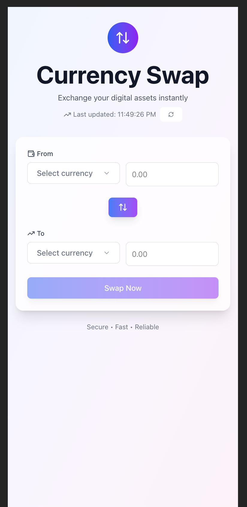

# Currency Swap Application

A modern, responsive currency swap application built with React, TypeScript, and Vite. This application allows users to exchange digital assets with real-time exchange rates and an intuitive user interface.



## 🚀 Features

- **Real-time Exchange Rates**: Fetches live currency data from Switcheo API
- **Token Images**: Visual token identification with fallback support
- **Form Validation**: Comprehensive input validation with error handling
- **Balance Checking**: Prevents swaps exceeding available wallet balance
- **Currency Swapping**: One-click currency pair swapping functionality
- **Responsive Design**: Mobile-first design that works on all devices
- **Loading States**: Smooth loading experiences with spinners
- **Error Handling**: User-friendly error messages and recovery
- **Modern UI**: Glassmorphism effects, gradients, and smooth animations

## 🛠 Tech Stack

- **Frontend Framework**: React 18
- **Language**: TypeScript
- **Build Tool**: Vite
- **Styling**: Tailwind CSS
- **UI Components**: shadcn/ui
- **Form Handling**: React Hook Form
- **Form Validation**: Zod
- **Icons**: Lucide React
- **Token Images**: Switcheo Token Icons Repository

## 📦 Package Versions

```json
{
  "dependencies": {
    "react": "^18.2.0",
    "react-dom": "^18.2.0",
    "react-hook-form": "^7.48.2",
    "@hookform/resolvers": "^3.3.2",
    "zod": "^3.22.4",
    "lucide-react": "^0.263.1"
  },
  "devDependencies": {
    "@types/react": "^18.2.43",
    "@types/react-dom": "^18.2.17",
    "@vitejs/plugin-react": "^4.2.1",
    "vite": "^5.0.8",
    "typescript": "^5.2.2",
    "tailwindcss": "^3.3.6",
    "postcss": "^8.4.32",
    "autoprefixer": "^10.4.16",
    "tailwindcss-animate": "^1.0.7"
  }
}
```

## 🚀 Getting Started

### Prerequisites

- Node.js (version 16 or higher)
- npm or yarn package manager

### Installation

1. **Clone the repository**
   ```bash
   git clone <repository-url>
   cd currency-swap-app
   ```

2. **Install dependencies**
   ```bash
   npm install
   # or
   yarn install
   ```

3. **Initialize Tailwind CSS**
   ```bash
   npx tailwindcss init -p
   ```

4. **Set up shadcn/ui**
   ```bash
   npx shadcn-ui@latest init
   ```

5. **Add shadcn/ui components**
   ```bash
   npx shadcn-ui@latest add button input select card form toast
   ```

### Running the Application

1. **Development Mode**
   ```bash
   npm run dev
   # or
   yarn dev
   ```
   Open [http://localhost:5173](http://localhost:5173) in your browser.

2. **Build for Production**
   ```bash
   npm run build
   # or
   yarn build
   ```

3. **Preview Production Build**
   ```bash
   npm run preview
   # or
   yarn preview
   ```

## 📁 Project Structure

```
currency-swap-app/
├── public/
├── src/
│   ├── components/
│   │   └── ui/          # shadcn/ui components
│   ├── lib/
│   │   └── utils.ts     # Utility functions
│   ├── App.tsx          # Main app component
│   ├── CurrencySwapForm.tsx  # Main swap form component
│   ├── index.css        # Global styles
│   └── main.tsx         # App entry point
├── package.json
├── tailwind.config.js   # Tailwind configuration
├── tsconfig.json        # TypeScript configuration
└── vite.config.ts       # Vite configuration
```

## 🔧 Configuration

### Tailwind CSS Setup

Update your `tailwind.config.js`:

```javascript
/** @type {import('tailwindcss').Config} */
export default {
  darkMode: ["class"],
  content: [
    './pages/**/*.{ts,tsx}',
    './components/**/*.{ts,tsx}',
    './app/**/*.{ts,tsx}',
    './src/**/*.{ts,tsx}',
  ],
  theme: {
    extend: {
      // Custom theme configuration
    },
  },
  plugins: [require("tailwindcss-animate")],
}
```

### Global Styles

Add to your `src/index.css`:

```css
@tailwind base;
@tailwind components;
@tailwind utilities;

@layer base {
  :root {
    /* CSS custom properties for theming */
  }
}
```

## 🌐 API Integration

The application integrates with the Switcheo API to fetch real-time currency data:

- **Endpoint**: `https://interview.switcheo.com/prices.json`
- **Response Format**:
  ```typescript
  interface Currency {
    currency: string;
    date: string;
    price: number;
  }
  ```

## 🎨 UI Components

### Custom Currency Selector
- Token images with fallback support
- Searchable dropdown with price information
- Click-outside functionality
- Keyboard navigation support
- Focus and active state styling

### Form Features
- Real-time validation
- Balance checking
- Exchange rate calculation
- Currency pair swapping
- Loading and error states

## 🔒 Features & Functionality

### 1. **Real-time Exchange Rates**
- Fetches latest currency prices
- Automatic rate calculation
- Price refresh functionality

### 2. **Form Validation**
- Required field validation
- Minimum amount validation
- Balance verification
- Error message display

### 3. **User Experience**
- Responsive design
- Loading states
- Error handling
- Success feedback
- Smooth animations

### 4. **Token Management**
- Visual token identification
- Balance display
- Mock wallet integration
- Currency swapping

## 🐛 Error Handling

The application includes comprehensive error handling for:
- API failures
- Network connectivity issues
- Invalid form inputs
- Insufficient balances
- Image loading failures

## 🎯 Performance Optimizations

- Lazy loading of components
- Optimized re-renders with React hooks
- Efficient API calls with loading states
- Image fallbacks for better UX
- Minimal bundle size with Vite

## 📝 License

This project is licensed under the MIT License - see the LICENSE file for details.

## 🙏 Acknowledgments

- [Switcheo](https://switcheo.com/) for providing the API and token icons
- [shadcn/ui](https://ui.shadcn.com/) for the beautiful UI components
- [Tailwind CSS](https://tailwindcss.com/) for the utility-first CSS framework
- [React Hook Form](https://react-hook-form.com/) for form handling
- [Lucide](https://lucide.dev/) for the icon library

## 📞 Support

For support, please open an issue in the GitHub repository or contact the development team.

---

**Built with ❤️ using modern web technologies**